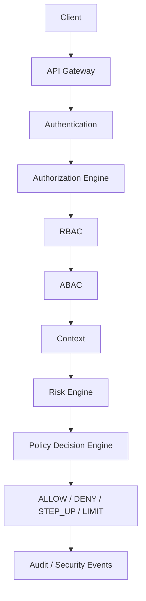

# Target Architecture

This document describes the intended AegisAI architecture. It is a target direction, not the current implementation.

## Detailed design

[System Architecture](architecture/SYSTEM_ARCHITECTURE.md) defines the complete
request flow and enforcement semantics. [Research Architecture](architecture/RESEARCH_ARCHITECTURE.md)
separately defines future behavioral anomaly detection and Models A–D.
[Threat Model V1](threat-model/THREAT_MODEL_V1.md) records proposed controls.
Authentication, Models A/B/C, and best-effort audit are IMPLEMENTED. The runner and
synthetic engine-only smoke artifacts are EXPERIMENTAL; see
[SPEC-009](specs/SPEC-009-EXPERIMENT-FRAMEWORK.md). Behavioral/AI Model D,
durable audit, and protected-operation enforcement remain PLANNED.

## Target Flow

Future behavioral analysis is a separate optional evidence pipeline, not an
implemented component of this request flow.

## IMPLEMENTED — Repository foundation

AEGISAI-002 provides a .NET 8 Clean Architecture solution and minimal health API. The legacy application has
been removed from the current working tree and will not be reused. New .NET 8
code must follow Clean Architecture and SOLID, with meaningful automated tests.

## PLANNED — AegisAI Components

Planned components:

- Authorization Engine:
  - Centralizes authorization decisions.
  - Starts with RBAC and adds ABAC and contextual inputs.
  - Produces structured authorization evidence.
- Risk Engine:
  - Computes contextual risk from request, identity, service, and environment signals.
  - Incorporates behavioral signals when available.
  - Provides risk classifications for policy evaluation.
- Policy Decision Engine:
  - Combines identity, authorization, risk, and policy inputs.
  - Produces `ALLOW`, `DENY`, `STEP_UP`, or `LIMIT`.
  - Emits explainable decision records.
- Audit / Telemetry / Security Events:
  - Captures decision inputs and outcomes.
  - Feeds research datasets and operational dashboards.
  - Supports incident analysis and automated response.

The experimental Model A RBAC engine is implemented; see [SPEC-005](specs/SPEC-005-RBAC.md). Model B adds ABAC in [SPEC-006](specs/SPEC-006-ABAC.md); Model C adds deterministic risk in [SPEC-007](specs/SPEC-007-CONTEXTUAL-RISK.md). Best-effort audit is implemented; durable audit and full enforcement remain PLANNED.

## Potential Technology Direction

Target technologies:

- .NET 8 / ASP.NET Core
- C#
- Python / FastAPI for ML experiments
- OIDC / OAuth2
- PostgreSQL
- Redis
- Kafka
- OpenTelemetry
- Docker Compose
- Kubernetes later

These are technology directions. .NET 8, Docker Compose development tooling, and
OpenTelemetry-compatible instrumentation exist; other external infrastructure
integrations remain PLANNED. See the current
[readiness report](V01_READINESS.md) for evidence and limitations.

## Target Service Boundaries

Potential future services and modules:

- `AegisAI.Gateway`
- `AegisAI.Identity` or external OIDC provider integration
- `AegisAI.Authorization`
- `AegisAI.Risk`
- `AegisAI.Policy`
- `AegisAI.Telemetry`
- `AegisAI.Experiments`
- Python experiment services or notebooks under `research/`

New service boundaries will be decided through specifications and ADRs. GloboTicket services will not be reused.

## Decision Model

Target policy decisions:

- `ALLOW`: Request proceeds.
- `DENY`: Request is rejected.
- `STEP_UP`: User or service must satisfy stronger authentication or verification.
- `LIMIT`: Request proceeds under reduced capability, rate, scope, or data exposure.

Models A/B return ALLOW/DENY. Model C adds STEP_UP/LIMIT recommendations with explicit obligations. All endpoints are decision queries only; protected action enforcement remains PLANNED.

## Observability Goals

Future observability should capture:

- Request identity and subject.
- Client and service context.
- Authorization attributes.
- Risk features and risk score.
- Policy decision and reason codes.
- Latency at each decision stage.
- Security event correlation IDs.
- Response action and outcome.

OpenTelemetry-compatible ActivitySource/Meter instrumentation and console audit
are implemented in [SPEC-008](specs/SPEC-008-AUDIT-OBSERVABILITY.md).
Exporters and durable audit remain PLANNED.
