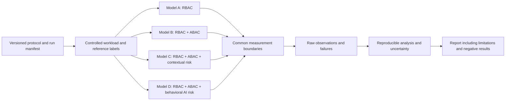
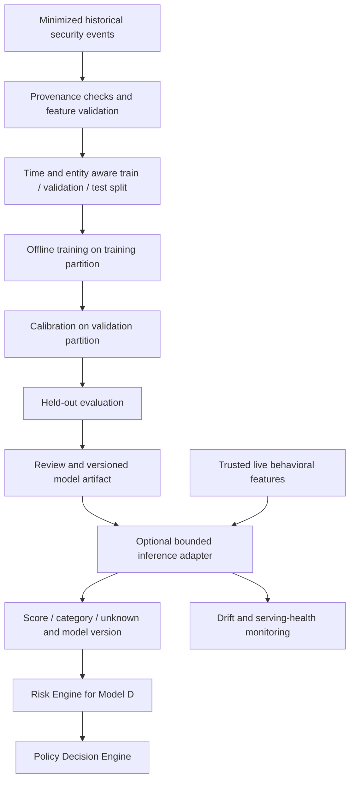

# AegisAI Research Architecture

Date: 2026-09-23  
Status: EXPERIMENTAL plans only; no experiments executed

IMPLEMENTED: this research design document and the software foundation described
in [SPEC-002](../specs/SPEC-002-SOLUTION-FOUNDATION.md).
PLANNED: workloads, datasets, experiment runners, scorers, and measurements.
No research results, benchmark values, datasets, trained models, or publications
are claimed. These comparisons are questions to test, not evidence of improvement.

## Comparison design

| Model | Definition | Variable under study |
| --- | --- | --- |
| A | RBAC | Role-based baseline |
| B | RBAC + ABAC | Additional attribute policies |
| C | RBAC + ABAC + contextual risk | Explicit contextual risk scoring |
| D | RBAC + ABAC + behavioral AI risk | Learned behavioral risk evidence |

All models use the same authentication, resource semantics, role assignments,
workload split, enforcement, audit requirements, instrumentation, and compute
budget. Unused stages are explicitly disabled. B, C, and D share ABAC policies;
C and D share hard authorization constraints. A receives only RBAC policy inputs.
Every variant still produces an auditable policy decision.

Model D replaces C's contextual scorer; it is not implicitly C plus AI. Declare
D's features and any overlap with contextual attributes. A combined contextual
and behavioral model requires a separately named run. A heuristic behavioral rule
must be labeled heuristic and cannot stand in for learned AI without disclosure.
A/B may produce only ALLOW/DENY; do not invent risk scores for them.

## Experiment pipeline — PLANNED

Before execution, define the reference authorization policy and independent benign/
malicious scenario labels. Do not derive ground truth from the evaluated model's
own decisions. Record ambiguous cases separately. Scenarios should include ordinary
traffic, forbidden actions, compromised identities, changes in legitimate behavior,
and missing or delayed evidence. These are intended scenarios, not an existing dataset.

Use paired workloads/seeds across models; randomize run order; specify warm-up,
measurement windows, concurrency/load levels, timeout budgets, and repetitions
before inspecting outcomes. Separate cold-start from steady-state measurements.
Report resource usage and infrastructure failures alongside performance. Keep all
valid runs, including unsuccessful outcomes; document exclusions and uncertainty
rather than selecting favorable runs.

## Intended metrics and measurement boundaries

| Metric | Operational definition for future runs | Reporting rules |
| --- | --- | --- |
| Authorization latency | Monotonic elapsed time from entry to Authorization Engine through final decision and required durable audit acceptance | Milliseconds; p50/p95/p99 and sample count; include remote risk calls; report timeouts/errors separately; exclude authentication and human challenge delay; also measure end-to-end latency separately |
| Throughput | Completed valid authorization decisions per measured second at a declared offered load | Decisions/s; denials are valid completions; separately report offered requests, timeouts/errors, successful protected actions, and resource limits |
| False-positive rate | FP / (FP + TN), where independently labeled benign requests are incorrectly flagged as suspicious | Define suspicious as risk/policy intervention for security reasons; separate DENY, STEP_UP, and LIMIT counts; legitimate policy denial alone is not an anomaly flag |
| False-negative rate | FN / (FN + TP), where independently labeled malicious requests are not flagged | Use the same fixed flag definition as FPR; additionally report malicious actions actually permitted after enforcement |
| Risk classification | Agreement between predicted risk categories and independently assigned reference categories for C/D | Confusion matrix, per-class precision/recall, macro-F1, class support; category boundaries fixed using training/validation only; unknown evidence reported separately; A/B are not applicable |
| Detection time | Elapsed time from known scenario attack onset to first correlated security detection | Report detected-event distribution plus detection coverage; undetected attacks are censored at window end, never zero or silently omitted |
| Response time | Elapsed time from first correlated detection to confirmed enforcement of the intended mitigation | Report completed-response distribution and completion rate; uncompleted responses are censored; distinguish policy decision time from actual enforcement; separately report attack-to-response time |

A metric with no eligible denominator is undefined/not applicable, not zero. Keep
anomaly detection errors separate from authorization-policy correctness errors.
A benign but unauthorized request can correctly be denied without being anomalous.
If a variant has no detector or response mechanism, report that capability absent
and its time metric not applicable; do not award it a zero-duration result.

Use monotonic clocks for local durations and documented clock synchronization or
runner-controlled timestamps for cross-service events. Report uncertainty from
clock skew. For user-assisted STEP_UP, report challenge completion/failure and
human delay separately. Predetermine how multiple alerts map to a single attack.

## Future behavioral anomaly detection — separate pipeline

Fit feature transformations only on training data. Prevent future-event and
subject/session leakage; explain any deliberate overlap required by the scenario.
Freeze the model and thresholds before held-out evaluation. Do not promote a model
merely because a held-out score improved after repeated tuning. Model family,
training schedule, feature windows, cold-start behavior, and drift thresholds are
open decisions. No automatic online retraining or policy updates are authorized
by this plan.

Features may eventually include request rate, action sequences, or deviation from
a subject's prior behavior. Their usefulness is unproven. Avoid secrets and
unnecessary identifying data. A missing, stale, malformed, or timed-out model
response yields unknown risk, subject to the system's explicit failure policy;
it is never silently interpreted as low risk. Behavioral inference supplies evidence,
not an authorization grant or autonomous unrestricted response.

## Reproducibility and artifacts

| Location | Intended content |
| --- | --- |
| research/datasets/ | Dataset source, permissions/license, schema, hashes, labels, lineage, and split manifests; sensitive data stays outside Git |
| research/experiments/ | Versioned protocol, model configuration, policy version, seeds, workload, and invocation |
| research/notebooks/ | Analysis that can be rerun from recorded inputs; no manual invented outputs |
| research/results/ | Raw observed outputs, run IDs, failures, timestamps, and analysis metadata |
| benchmarks/ | Executable performance harness and measurement configuration |
| papers/ | Manuscripts that cite only verifiable sources and actual results |

Record source commit, dependency/runtime versions, OS/hardware, resource allocations,
cache state, network setup, scorer artifact hash, threshold configuration, and
instrumentation version. Label synthetic data explicitly and store its generator
and seeds. No numeric targets or expected improvements are asserted in this task.

## Threats to validity

Synthetic scenarios may not represent deployment traffic; class imbalance can hide
poor minority-class detection; labeling errors distort FPR/FNR; shared infrastructure
and caching can confound latency; telemetry can leak future information; concept
drift and cold starts can invalidate behavioral assumptions. Record these limits,
report per-scenario results and unknown coverage, and avoid extrapolating to
production security from a controlled experiment.

See [Threat Model V1](../threat-model/THREAT_MODEL_V1.md) for adversarial risks and
[System Architecture](SYSTEM_ARCHITECTURE.md) for decision and enforcement semantics.
