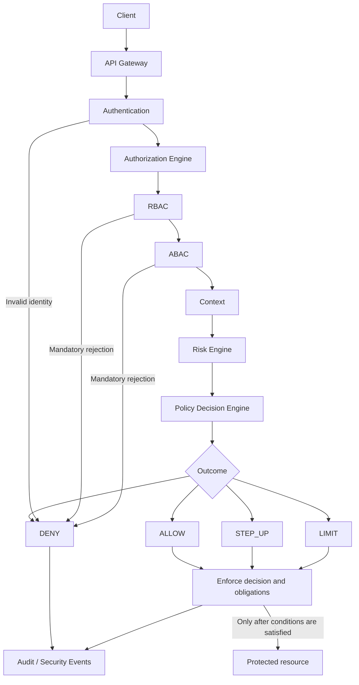
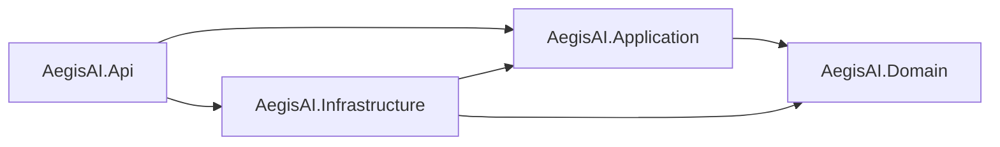

# AegisAI System Architecture

Date: 2026-09-23  
Status: PLANNED system design; IMPLEMENTED documentation

Only the .NET 8 project structure, health endpoint, and foundation tests currently
exist. The following design is the target specified by [SPEC-003](../specs/SPEC-003-AEGISAI-ARCHITECTURE.md).

## Request decision flow

The logical flow is Client → API Gateway → Authentication → Authorization Engine
→ RBAC → ABAC → Context → Risk Engine → Policy Decision Engine → ALLOW / DENY /
STEP_UP / LIMIT → Audit / Security Events. Enforcement makes the decision effective;
a decision alone does not authorize downstream access. Audit covers denials,
challenges, restrictions, allows, and enforcement failures.

## Responsibilities and planned contracts

| Component | Responsibility and output |
| --- | --- |
| API Gateway | Route requests, bound request size and rate, propagate trusted correlation metadata; discard client-supplied internal identity headers |
| Authentication | Validate credentials, intended issuer/audience, expiry, and required assurance; produce a verified principal or reject |
| Authorization Engine | Coordinate evaluation for a bound subject, tenant, resource, and action; collect evidence without executing the protected operation |
| RBAC | Resolve trusted role assignments and permitted actions; mandatory denial is final |
| ABAC | Evaluate subject/resource/environment attributes with provenance and freshness; do not trust arbitrary client attributes |
| Context | Assemble additional time, device, request, and service signals for risk assessment; represent missing/stale evidence explicitly |
| Risk Engine | Produce score or category, evidence references, scorer version, and freshness; unknown is a distinct state, not low risk |
| Policy Decision Engine | Apply versioned rules to authorization evidence and risk; select an outcome and structured reasons/obligations |
| Enforcement boundary | Bind decision to the original request and apply restrictions or assurance requirements before performing any protected action |
| Audit / Security Events | Persist minimized decision and enforcement records and publish security events for later analysis |

ABAC may use a declared subset of environmental attributes. The Context stage
adds risk features; it does not retroactively override failed ABAC. Attribute
snapshots should be consistent across stages or carry explicit timestamps.

A future evaluation request should identify request/correlation ID, verified
principal reference, tenant, resource, action, trusted attributes with provenance,
and evaluation time. A decision should include decision ID, outcome, reason codes,
policy version, expiry, request binding, risk status, and obligations. External
scorer evidence should carry a model/version ID, observation time, and schema
version. Exact C# contracts are deferred; these are design fields, not existing APIs.

## Outcome semantics

| Outcome | Planned effect |
| --- | --- |
| ALLOW | Proceed only within the bound resource/action and validity period |
| DENY | Reject the protected action and record a reason |
| STEP_UP | Hold access; require stronger verified assurance, then reevaluate a new bound request; failure or unsupported challenge denies access |
| LIMIT | Proceed only after enforceable reduced scope, rate, or data constraints are applied; unsupported obligations deny access |

Unknown outcomes, malformed decisions, expired evidence, and enforcement failures
must not become ALLOW. Hard role, tenant, and attribute restrictions remain
mandatory even when risk is low. Decision expiry and revalidation near the protected
operation reduce stale-decision exposure; exact consistency guarantees require a
resource-specific design. Enforcement must exist at the protected resource boundary
so direct service calls cannot bypass gateway decisions.

## Clean Architecture mapping

These arrows are existing project dependencies, not network calls. In the planned
implementation, Domain owns policy concepts and invariants; Application owns use
cases and interfaces; Infrastructure supplies identity, storage, context, scorer,
and event adapters; Api composes them and exposes transport endpoints. Follow
[ADR-001](../adr/ADR-001-CLEAN-ARCHITECTURE.md). Logical engines may initially be
modules within these projects. Separate microservices are not required by this diagram.

## Failure and operational behavior — PLANNED

- Reject invalid identity and missing required authorization attributes.
- Bound all remote calls. A required risk source that times out yields unknown
  risk and DENY by default. Any future degraded policy must be explicit, versioned,
  audited, and tested; it must never bypass mandatory authorization.
- Maintain a versioned policy snapshot during evaluation; reject unrecognized or
  invalid policy versions rather than using client-supplied policy.
- Require durable local audit acceptance before allowing a protected action.
  Downstream publication may retry asynchronously with event IDs for deduplication.
  If durable acceptance fails, deny and raise an operational fault. Availability
  costs and storage backpressure must be measured in later work.
- Record decision intent separately from actual enforcement outcome. A process
  crash between action and outcome logging requires reconciliation; an audit
  record alone must not be treated as proof that an action executed.
- Minimize logged identifiers and attributes; never log bearer tokens, passwords,
  or full sensitive request bodies. Define retention and access controls before
  collecting telemetry.

## Future behavioral anomaly detection — separate capability

The core request path must not train models. A future isolated pipeline prepares
historical features, trains/evaluates models offline, and publishes reviewed,
versioned artifacts. Optional serving supplies bounded behavioral evidence to the
Risk Engine for Model D. It cannot alter roles, policies, or access directly.

See [Research Architecture](RESEARCH_ARCHITECTURE.md) for the separate pipeline,
unknown-risk handling, and experiment plans, and
[Threat Model V1](../threat-model/THREAT_MODEL_V1.md) for proposed security tests.
