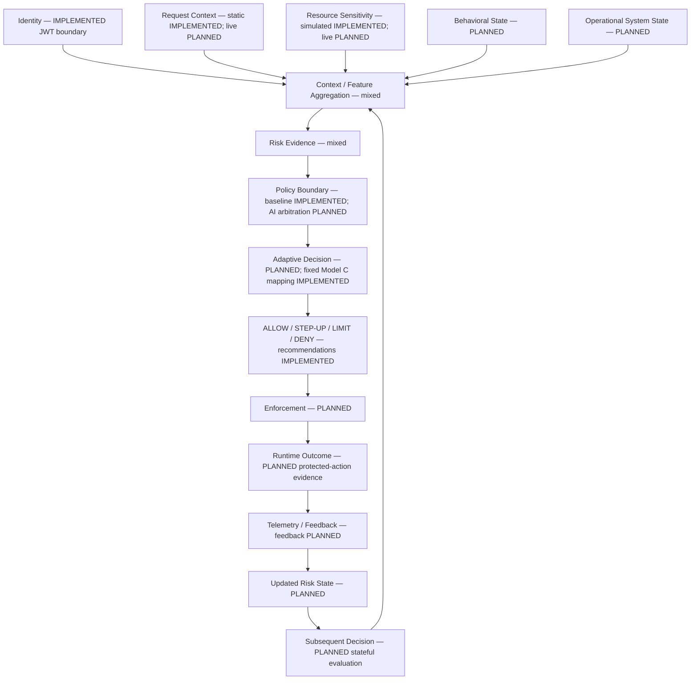

# Conceptual research architecture

Date: 2026-09-25 | Baseline: AEGISAI-012
Status: **PLANNED** closed-loop architecture; only the subset below is implemented.

The following flow is a conceptual research target, not an existing runtime path.
Every node marked mixed contains implemented baseline elements and planned
extensions; the table defines that boundary.

## Evidence and status boundaries

| Component | Status and current evidence | Planned extension |
| --- | --- | --- |
| Identity | **IMPLEMENTED** JWT authentication and issuer-qualified identity at API boundary; runner identities are synthetic | Deployment identity/assurance integration |
| Request context and resource sensitivity | **IMPLEMENTED** request binding, static attribute snapshots and simulated Model C sensitivity | Trusted live observations, provenance/freshness |
| Context / feature aggregation | **IMPLEMENTED** per-request provider lookup of immutable fixtures | Temporal features, behavioral and operational aggregation |
| Risk evidence | **IMPLEMENTED** fixed weighted score, Unknown handling and contributions | Behavioral anomaly evidence and combined operational assessment |
| Policy boundary | **IMPLEMENTED** RBAC/ABAC rejection precedes risk and cannot be overridden in C | Explicit arbitration of probabilistic recommendations and stateful guardrails |
| Adaptive decision / outcomes | **IMPLEMENTED** fixed C thresholds and ALLOW, STEP_UP, LIMIT, DENY recommendations | Stateful adaptive mapping within versioned policy limits |
| Enforcement and runtime outcome | **PLANNED**; decision endpoints execute no protected operations | Apply challenges/limits and verify actual outcomes |
| Telemetry / feedback | **IMPLEMENTED** best-effort decision console audit and tracing/metrics; **PLANNED** outcome feedback | Durable intent/outcome records, causal correlation and feedback ingestion |
| Behavioral/operational state, updated risk and subsequent stateful decision | **PLANNED**; no state store, detector or feedback consumer | Versioned state scope, update rules, decay and recovery |
| Experiment framework / static fixtures | **IMPLEMENTED** runner; **EXPERIMENTAL** synthetic A–C smoke artifacts | Independent labels, D and distributed enforcement experiments |

See [Model definitions](RESEARCH_MODELS.md),
[SPEC-008](../specs/SPEC-008-AUDIT-OBSERVABILITY.md) and
[SPEC-009](../specs/SPEC-009-EXPERIMENT-FRAMEWORK.md) for repository evidence.
EXPERIMENTAL applies to existing synthetic usage, not to an executed Model D.
No closed-loop experiment or operational-state collector exists.

## Planned policy and feedback constraints

The diagram groups risk inputs conceptually; actual A–C evaluation short-circuits
on mandatory authorization rejection before scoring. Future D must preserve that
boundary. A low model score cannot override RBAC/ABAC. STEP-UP holds access pending
verified assurance and reevaluation; LIMIT requires an enforced restriction.
Unsupported obligations must deny, as described in
[System Architecture](../architecture/SYSTEM_ARCHITECTURE.md).

Future specifications must define state scope, timestamps, freshness, unknowns,
update ordering, delayed/duplicate feedback, risk decay, action scope/duration,
escalation limits, and recovery. Stabilization mechanisms are research candidates,
not established safeguards. Decision-induced changes in telemetry must not be
mistaken for independent evidence of compromise. Outcome feedback does not imply
automatic retraining, permission grants or autonomous policy rewriting.
