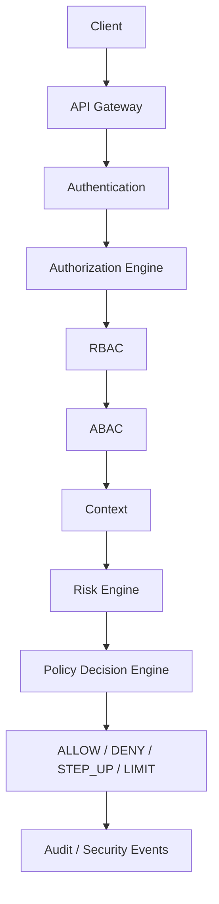

# SPEC-003 — AegisAI Research and System Architecture

Date: 2026-09-23  
Task: AEGISAI-003  
Status: IMPLEMENTED documentation; system capabilities PLANNED

## Scope and evidence

AegisAI — Adaptive Intelligence for Secure Distributed Systems.
Observe. Assess. Authorize. Respond.

IMPLEMENTED: the .NET 8 solution, Clean Architecture project boundaries, minimal
GET /health endpoint, and foundation tests described in
[SPEC-002](SPEC-002-SOLUTION-FOUNDATION.md). This task adds design documentation only.
PLANNED: every gateway, identity, authorization, risk, policy, enforcement, audit,
and research capability described below. EXPERIMENTAL: proposed experiments only;
none have run and no findings, datasets, benchmarks, or citations are asserted.

The 2022 Securing-Microservices application remains historical and is not reused.
AegisAI development begins in 2026; see [project history](../PROJECT_HISTORY.md).

## Required logical flow

This is the full target evaluation order, not a requirement to deploy each box as
a service. Research variants disable unused stages explicitly. Failed identity or
mandatory authorization checks terminate evaluation with denial and an audit event.
The Policy Decision Engine selects an outcome; a separate enforcement boundary
must apply it before access. Risk can restrict permission but cannot grant a
permission rejected by RBAC or ABAC.

## Design requirements

| ID | PLANNED requirement | Future verification |
| --- | --- | --- |
| ARCH-01 | Retain .NET 8, Clean Architecture, SOLID, and inward dependencies from ADR-001 | Architecture and behavioral tests |
| ARCH-02 | Authenticate before evaluating authorization; bind identity, tenant, resource, and action | Invalid credential and cross-tenant tests |
| ARCH-03 | Evaluate RBAC, ABAC, context, risk, then policy for the full flow | Deterministic evaluation and stage-order tests |
| ARCH-04 | Distinguish ALLOW, DENY, STEP_UP, and LIMIT; enforce obligations before access | Challenge, restriction, and bypass tests |
| ARCH-05 | Record decision evidence and enforcement results with correlation and version identifiers | Audit completeness and redaction tests |
| ARCH-06 | Keep future behavioral anomaly detection separate from core authorization | Scorer unavailable, stale evidence, and malformed output tests |
| ARCH-07 | Compare Models A–D under a controlled protocol with defined metrics | Reproducible experiment manifests and raw outputs |
| ARCH-08 | Apply bounded timeouts, default-deny behavior, and explicit missing-data handling | Failure injection and recovery tests |

These verification activities are future acceptance criteria, not passing tests
claimed by this documentation task.

## Research contract

| Variant | Definition |
| --- | --- |
| Model A | RBAC |
| Model B | RBAC + ABAC |
| Model C | RBAC + ABAC + contextual risk |
| Model D | RBAC + ABAC + behavioral AI risk |

Model D does not silently add Model C's contextual scorer. Any combined scorer is
a separately named experiment. All variants share authentication, enforcement,
workload, and measurement boundaries.

Intended metrics: authorization latency, throughput, false-positive rate,
false-negative rate, risk classification, detection time, and response time.
Definitions, denominators, exclusions, and reproducibility rules are in
[Research Architecture](../architecture/RESEARCH_ARCHITECTURE.md).

## Supporting designs and unresolved choices

[System Architecture](../architecture/SYSTEM_ARCHITECTURE.md) defines responsibilities,
contracts, enforcement, and failure behavior.
[Threat Model V1](../threat-model/THREAT_MODEL_V1.md) defines assets, boundaries,
threats, proposed controls, and residual risks.

Identity provider, gateway product, storage, message transport, model family,
thresholds, numeric performance targets, deployment topology, retention periods,
and datasets require later specifications or ADRs. Earlier technology lists are
candidates, not installed dependencies or validated choices.

## Completion criteria for AEGISAI-003

Create this specification and the three linked design documents with Mermaid
diagrams, update the chronological development log, validate local links and
diffs, and run the existing tests with their normal build step. No major
functionality, experimental run, commit, or history change is included.
