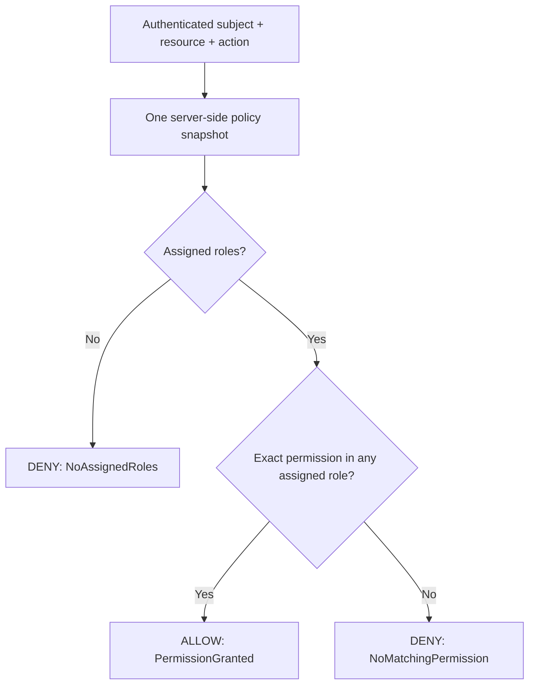

# SPEC-005 — Model A: RBAC Authorization Baseline

Date: 2026-09-23  
Status: IMPLEMENTED experimental baseline; pending review

AEGISAI-012 clarification (2026-09-25): this specification records the AEGISAI-005
task scope. Statements about absent later models, tooling or measurements describe
that historical task, not the current repository. Models A–C, best-effort audit,
local synthetic credential tooling and the A–C engine-only runner now exist;
Model D, behavioral ML, durable audit and protected-operation enforcement remain
PLANNED. See [Research Models](../research/RESEARCH_MODELS.md) for current evidence.

## Scope and evidence

Model A = RBAC. This task adds a deterministic role-based decision engine and an
authenticated endpoint for exercising it. Only ALLOW and DENY exist. ABAC, context,
risk scoring, STEP_UP, LIMIT, audit persistence, and protected action execution
are not implemented. EXPERIMENTAL describes the intended research use; no research
experiments, performance measurements, or security effectiveness results are claimed.

The .NET 8 and Clean Architecture boundaries in [ADR-001](../adr/ADR-001-CLEAN-ARCHITECTURE.md)
and the identity boundary in [ADR-002](../adr/ADR-002-IDENTITY-BOUNDARY.md) are retained.

## Concepts and ownership

| Concept | Layer | Meaning |
| --- | --- | --- |
| Subject | Domain | Nonblank subject ID and issuer; the pair identifies an actor |
| Role | Domain | Named immutable collection of permissions |
| Permission | Domain | A resource/action pair, not two independent sets |
| Resource | Domain | Nonblank opaque resource identifier |
| Action | Domain | Nonblank opaque action name; unrelated to System.Action |
| AuthorizationRequest | Application | Subject, resource, and action being evaluated |
| AuthorizationDecision | Application | ALLOW/DENY, stable reason, and policy version |
| RbacPolicy | Application | Immutable validated snapshot of role definitions and subject assignments |
| IAuthorizationEngine | Application | Provider-neutral decision abstraction |
| IRbacPolicyProvider | Application | Supplies a complete policy snapshot per evaluation |
| InMemoryRbacPolicyProvider | Infrastructure | Retains the startup snapshot for the process lifetime |

Api translates HTTP input and the authenticated identity into an Application
request and serializes the decision. Business decision rules live in
RbacAuthorizationEngine, not the endpoint. Inner layers have no framework or
identity-provider dependencies. Api reads configuration at composition time;
Infrastructure stores the snapshot through the Application interface.

## Assumptions

- Role assignments and permissions come only from trusted server configuration.
  Token role claims, request roles, and user-supplied identity headers grant nothing.
- The HTTP subject is derived from the validated issuer/sub pair through
  ICurrentIdentity. Direct in-process engine callers must establish equivalent
  trust; constructing a Subject is not authentication.
- Identifiers use ordinal, case-sensitive equality, without trimming, wildcard
  expansion, resource hierarchies, or implicit administrator privileges. A literal
  `*` only matches a literal `*`.
- Permissions are positive grants. Multiple roles combine by union. No explicit
  deny rules, role inheritance, role activation, or separation-of-duty constraints
  exist in this baseline.
- Unknown subjects, no assigned roles, empty roles, and unmatched permissions deny.
  There is no implicit default role.
- Policy definitions have a nonblank operator-supplied version. Duplicate role names,
  duplicate issuer/subject assignments, undefined assigned roles, and invalid
  identifiers fail policy construction. Repeated permissions/role memberships are
  deduplicated. Empty policies are valid and deny everything.
- Configuration is trusted administrative input. The version is a label, not a
  content hash or signature; experiment manifests must retain the exact policy.

## Decision algorithm

1. Require a structurally valid AuthorizationRequest.
2. Obtain one immutable policy snapshot for the entire evaluation.
3. Resolve roles for the exact issuer/subject pair. If none, return DENY with
   `NoAssignedRoles`.
4. Search those roles for a permission matching both the requested resource and
   action. If any exists, return ALLOW with `PermissionGranted`.
5. Otherwise return DENY with `NoMatchingPermission`.
6. Include the snapshot's policy version in every decision.

Malformed in-process input throws an argument exception. A policy-provider failure
propagates as an operational error and never produces ALLOW; it is not mislabeled
as a completed policy denial. There is no remote provider or retry logic yet.



## HTTP contract

`POST /authorization/evaluate` requires the JWT authentication from
[SPEC-004](SPEC-004-AUTHENTICATION.md). Request body:

```json
{"resource":"reports","action":"read"}
```

Resource and action must each be nonblank strings of at most 256 characters at the
HTTP boundary. Unknown body members, including subject/issuer/roles/permissions,
are rejected. Only the authenticated caller's decision can be requested.

Example response shape (illustrative, not a recorded experiment result):

```json
{
  "model": "A",
  "outcome": "ALLOW",
  "reason": "PermissionGranted",
  "policyVersion": "example-model-a-v1",
  "resource": "reports",
  "action": "read"
}
```

| HTTP status | Meaning |
| --- | --- |
| 200 | Evaluation completed; inspect outcome for ALLOW or DENY |
| 400 | Invalid JSON, unsupported body members, missing/blank/overlong identifiers |
| 401 | Missing or invalid authentication, or no usable current identity |
| 415 | Unsupported request content type |
| 5xx | Operational failure; no successful authorization decision |

A DENY response is intentionally HTTP 200 because this endpoint evaluates a query;
it is not a failed attempt to execute the named operation. An ALLOW response is
not a capability token, enforcement action, or durable audit record. No protected
resource is read or modified. `/health` and `/identity` retain their behavior.

## Configuration and exercising the endpoint

The example in src/AegisAI.Api/appsettings.example.json includes:

```json
{
  "Rbac": {
    "Version": "example-model-a-v1",
    "Roles": [
      {
        "Name": "reader",
        "Permissions": [{"Resource":"reports","Action":"read"}]
      }
    ],
    "Assignments": [
      {
        "Subject": "replace-with-verified-subject",
        "Issuer": "https://identity.example.invalid",
        "Roles": ["reader"]
      }
    ]
  }
}
```

The example file is not automatically loaded and contains no real secrets or
production assignments. Supply `Rbac` through normal host configuration; for
example `Rbac__Version`, `Rbac__Roles__0__Name`, and corresponding indexed keys.
Set the issuer/subject to the intended verified identity and configure authentication
as described in SPEC-004. Never commit access tokens or sensitive role assignments.
Absent `Rbac` configuration creates policy `unconfigured` with no grants. Unknown
configuration properties are rejected to catch misspellings. Changes require a
process restart; runtime editing and an administrative API are out of scope.

Send the JSON above with Content-Type application/json and an Authorization Bearer
header containing an actual valid access token. This repository supplies no tokens,
local signing secrets, or automatic authentication bypass.

## Test scenarios

Domain tests verify nonblank identifiers, required permission components,
issuer-qualified equality, exact matching semantics, and immutable role permissions.
Application tests verify:

- Matching permission allows; wrong resource or action denies.
- Matching is case-sensitive, whitespace-preserving, and has no wildcard semantics.
- Multiple roles combine by union; order and duplicates do not change outcomes.
- Unassigned/unknown subjects and different issuers deny; empty roles deny.
- Resource and action must match the same permission, not separate permission pairs.
- Invalid/ambiguous policies and malformed requests are rejected.
- Policy snapshots are insulated from mutation and repeated evaluation is stable.
- Provider failure propagates rather than allowing.

Integration tests exercise the real JWT handler with ephemeral keys and the actual
configuration adapter, engine, and endpoint. They cover ALLOW/DENY, exact response
fields, issuer isolation, role-claim/header spoofing, anonymous/invalid credentials,
invalid/malformed input, identity injection, overlong values, invalid policy
configuration, and the deny-all unconfigured policy. Existing authentication,
health, and project-dependency tests remain part of the suite.

## Limitations and future work

This is a flat, single-process, positive-grant RBAC baseline. There is no resource
registry, tenancy model, ownership rule, ABAC, risk scoring, model training,
revocation, distributed policy synchronization, hot reload, persistent audit,
rate limiting, or protected resource enforcement. A role assignment persists until
the process is restarted with updated configuration. Do not infer that the full
system or Threat Model V1 controls are implemented.

The decision endpoint exposes reason/version information to authenticated callers
for experiments; deployment exposure and audit/privacy controls require separate
work. No latency/throughput or research metrics are collected here. Future Model A
experiments must add the measurement and audit boundaries in
[Research Architecture](../architecture/RESEARCH_ARCHITECTURE.md) before reporting
comparable results. Models B–D remain PLANNED.
