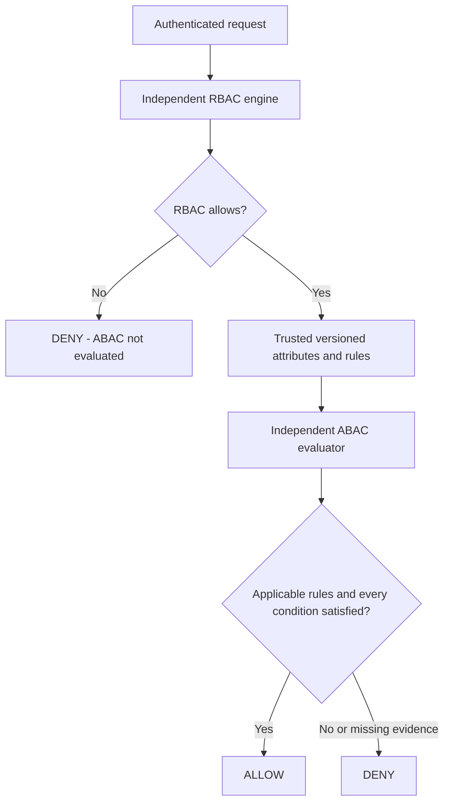

# SPEC-006 — Model B: RBAC + ABAC

Date: 2026-09-23  
Status: IMPLEMENTED experimental software; pending review

## Scope

Model B composes the existing Model A RBAC engine with an independently testable
ABAC evaluator. Both stages must allow. Model A's endpoint and decision algorithm
remain unchanged. No AI, behavioral detection, contextual risk scoring, research
results, performance claims, or protected actions are implemented by this task.

See [SPEC-005](SPEC-005-RBAC.md), [ADR-003](../adr/ADR-003-POLICY-EVALUATION.md), and
[ADR-002](../adr/ADR-002-IDENTITY-BOUNDARY.md).

## Attribute and policy model

Domain owns immutable AttributeSet, AttributeCondition, and AbacRule concepts.
Application owns AbacContext, IAbacEvaluator, IAbacContextProvider, and the Model B
composition engine. Infrastructure supplies a startup snapshot. Api binds
configuration and HTTP contracts without evaluating business policy.

| Scope | Source | Example only |
| --- | --- | --- |
| Subject | Server snapshot keyed by exact issuer/subject pair | department = engineering |
| Resource | Server snapshot keyed by exact resource ID | classification = internal |
| Environment | Server snapshot shared by evaluations in this process | network = trusted |
| Action | Actual requested action; only key `name` is supported | name = read |

All keys and values are nonblank strings. Matching is ordinal and case-sensitive;
there is no trimming, wildcard expansion, numeric coercion, expression language,
regex, or inference. Each condition checks equality with a configured literal.
This intentionally small language supports controlled fixtures, not a general
production policy standard. A condition cannot compare two attribute references.
The requested action also selects applicable rules by exact match.

Rules have unique IDs, an exact resource/action target, and one or more conditions.
All conditions in all applicable rules are mandatory. Empty condition sets,
undefined scopes, unsupported action keys, duplicate rule IDs, duplicate subject
or resource entries, and invalid identifiers fail snapshot construction. Multiple
rules do not provide alternative grants; contradictory conditions deny.

## Trust and snapshot lifecycle

Subject/resource/environment attributes are trusted administrative configuration.
The caller supplies only resource and action. JSON attribute bags, subject IDs,
roles, or other extra fields are rejected; custom headers and token attributes
are not promoted into ABAC evidence. Subject identity comes from the existing
validated authentication boundary. Attributes never bypass authentication.

The snapshot version covers both ABAC rules and attribute fixtures. It is an
operator label, not a signed content hash; preserve exact configuration alongside
version labels for reproducibility. Construction copies input collections, validates
them, and occurs after host configuration is finalized but before requests are
served. A restart is required for changes. RBAC and ABAC versions are reported
separately; there is no cross-process configuration transaction or hot reload.

Environment attributes here are static experiment inputs, not measured network or
device facts. No claim of live telemetry, provenance verification, freshness, or
revocation is made. Future dynamic providers must define source integrity, freshness,
timeouts, and consistent snapshots before deployment. Non-HTTP callers are responsible
for providing authenticated requests and trusted contexts to these abstractions.

## Evaluation algorithm

1. Evaluate RBAC through IAuthorizationEngine using the original request.
2. If RBAC does not allow, return DENY and mark ABAC not evaluated. Do not resolve
   attribute context or call the ABAC evaluator.
3. Obtain one trusted AbacContext from IAbacContextProvider.
4. Select rules matching the request's resource and action. No applicable rules
   yields DENY / NoApplicableRules, including absent ABAC configuration.
5. Evaluate every condition against its declared scope. Any absent key yields
   DENY / MissingAttribute. Otherwise any unequal value yields DENY /
   ConditionNotSatisfied. Missing evidence takes precedence over mismatch regardless
   of rule order. A missing value never equals another missing value.
6. Only when every applicable condition passes return ALLOW / ConditionsSatisfied.

Provider failures propagate as operational failures rather than an ALLOW or a
completed policy decision. No exception fallback or default successful condition
is used. Null/malformed in-process inputs are rejected.



## API

Model A: `POST /authorization/evaluate` (unchanged).
Model B: `POST /authorization/evaluate/model-b`.
Both require authentication and accept:

```json
{"resource":"reports","action":"read"}
```

Identifiers must be nonblank and at most 256 characters at the HTTP boundary.
Unknown body members and invalid JSON yield 400; unauthenticated requests yield
401. A completed evaluation returns 200 for either ALLOW or DENY. Unsupported
content type yields 415. Provider failures are operational errors, not decisions.

Illustrative Model B response, not a measured research outcome:

```json
{
  "model": "B",
  "outcome": "ALLOW",
  "resource": "reports",
  "action": "read",
  "rbac": {"outcome":"ALLOW","reason":"PermissionGranted","policyVersion":"example-model-a-v1"},
  "abac": {"outcome":"ALLOW","reason":"ConditionsSatisfied","snapshotVersion":"example-model-b-v1"}
}
```

When RBAC denies, `abac` is null, explicitly meaning not evaluated. Responses omit
attribute values and tokens. They expose stage decisions for controlled comparisons.
Neither endpoint executes protected resources or issues an access capability.
Selecting Model A for a comparison does not bypass protection of any actual resource;
these endpoints must not be treated as production enforcement mechanisms.

## Configuration

The unautoloaded `src/AegisAI.Api/appsettings.example.json` now contains a complete
synthetic Abac example alongside existing authentication and Rbac examples.
`Abac:Version` identifies the combined rule/attribute snapshot. Configure:

- `Abac:Rules`: Id, Resource, Action, Conditions (Scope, Key, Expected).
- `Abac:Subjects`: Id, Issuer, Attributes dictionary.
- `Abac:Resources`: Id, Attributes dictionary.
- `Abac:Environment`: attributes dictionary.

Scopes are Subject, Resource, Environment, or Action. There are no built-in
departments, classification rules, or special values in the engine. Changing
configured literals or fixtures changes decisions according to the same algorithm.
Unknown configuration properties fail binding. Invalid configured ABAC prevents
host startup, including Model A; absent ABAC permits startup but Model B denies
RBAC-granted requests because no rules apply. ASP.NET configuration keys themselves
are case-insensitive, so do not define keys distinguished only by casing in host
configuration; Domain attribute lookup is ordinal.

Use normal configuration providers or environment variables with double underscores
and array indexes, for example `Abac__Rules__0__Conditions__0__Expected`. Example
values are placeholders, not verified environment facts. No real secrets or
production subject data are included.

## Tests and comparison scenarios

Unit tests isolate ABAC scopes, requested action, exact equality, missing evidence,
no matching resource/action rule, all-rules semantics, order independence, immutable
collections, invalid policies, and provider failure. Composition tests compare:

| Representative fixture | Model A | Model B |
| --- | --- | --- |
| Role grants and all ABAC conditions pass | ALLOW | ALLOW |
| Role grants but a subject attribute mismatches | ALLOW | DENY |
| No RBAC assignment even with matching attributes | DENY | DENY; ABAC skipped |

These are test assertions, not experimental findings. Integration tests exercise
the real JWT handler, actual configuration providers, both engines, and endpoint
serialization. They cover paired comparisons, resource/environment changes,
issuer-bound subject attributes, missing ABAC configuration, spoofed headers,
body attribute injection, invalid inputs, authentication, and invalid configuration.
Existing Model A and authentication tests continue to run.

## Limitations and follow-up

This baseline uses static string-equality policies and fixtures. It lacks dynamic
attributes, cross-attribute comparisons, time/numeric operators, alternative rule
sets, policy administration, audit persistence, resource enforcement, and research
measurement tooling. It does not implement all target architecture controls.
PLANNED: Models C/D and the methodology/instrumentation needed for actual research
comparisons. EXPERIMENTAL: Models A/B software only; no benchmark values or datasets
are asserted by this work.
