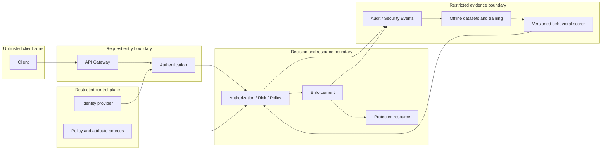

# AegisAI Threat Model V1

Date: 2026-09-23  
Status: PLANNED controls and verification; IMPLEMENTED documentation

## Scope and current exposure

This model covers the target request, decision, enforcement, audit, and future
behavioral research pipelines in [SPEC-003](../specs/SPEC-003-AEGISAI-ARCHITECTURE.md).
The actual implementation currently exposes only GET /health and contains no
authentication, business resources, risk scorer, or deployed security controls.
Foundation tests do not demonstrate mitigation of the threats listed here.

The design assumes an untrusted client/network and potentially compromised user
or service credentials. Operators and research contributors can make mistakes or
act maliciously. Identity, policy, telemetry, and model sources require explicit
trust and access controls; internal network location alone conveys no authority.
The 2022 legacy application is outside this runtime design and remains historical.

## Assets and boundaries

Assets include protected resources, identities and credentials, role assignments,
tenant isolation, attributes, policy versions, risk evidence, decision integrity,
service availability, audit integrity, private telemetry, training labels, model
artifacts, and research reproducibility.

Crossing a boundary requires authenticated sources, integrity validation, bounded
inputs, and least-privilege access. Research access to telemetry is distinct from
permission to publish a model. Model publication is distinct from authority to
change access policy. Deployment-specific network and storage boundaries remain open.

## Threat register — all controls PLANNED

Priorities are qualitative design triage, not measured likelihood or severity scores.
P1 means address before protected resources or relevant telemetry/model processing
are introduced; P2 means address before realistic deployment experiments.

| ID / priority | Threat and affected boundary | Proposed control | Future verification / residual risk |
| --- | --- | --- | --- |
| T01 / P1 | Forged, expired, replayed, or misdirected credentials at authentication | Validate issuer/audience/signature/lifetime and assurance; protect transport and credentials; define revocation and replay controls | Negative token/replay tests; stolen valid tokens may remain usable until expiry/revocation |
| T02 / P1 | Forged roles, tenant IDs, or context supplied through gateway headers | Strip untrusted internal headers; resolve attributes from authenticated sources with provenance/freshness | Header spoofing, stale attribute, and cross-tenant tests; compromised authoritative sources remain a risk |
| T03 / P1 | Privilege escalation through permissive policy or a low risk score | Mandatory RBAC/ABAC denials cannot be overridden; validate versioned policy changes and restrict administration | Deny-precedence and unauthorized policy-change tests; policy intent can still be wrong |
| T04 / P1 | Bypass gateway or reuse a decision for a different action/resource | Enforce at resource boundary; bind subject, tenant, action, resource, expiry, and decision ID | Direct-call, replay, and changed-resource tests; race windows require resource-specific consistency |
| T05 / P1 | STEP_UP or LIMIT treated as unconditional access | Require verified stronger assurance and reevaluation; enforce supported restrictions before action; reject unknown obligations | Challenge bypass and unenforced-limit tests; enforcement adapter defects remain possible |
| T06 / P1 | Risk dependency outage or tampered result causes fail-open access | Authenticate scorer, validate schema/version/freshness, use bounded timeouts and unknown-risk default denial | Timeout, malformed score, stale model, and recovery tests; denial reduces availability |
| T07 / P2 | Resource exhaustion through expensive evaluations, oversized requests, or event floods | Request/rate limits, bounded queues and computation, backpressure, per-tenant budgets | Load/fault tests and fairness measurements; thresholds require workload evidence |
| T08 / P1 | Audit deletion, alteration, duplication, or decision/action mismatch | Durable intent acceptance, restricted append access, event IDs, integrity monitoring, outcome reconciliation | Crash, duplicate, storage-failure, and tampering tests; durable intent does not prove action completion |
| T09 / P1 | Secrets or personal data leaked through logs, features, errors, or datasets | Data minimization, redaction, restricted access, encryption, explicit retention/deletion and dataset permissions | Sensitive-data canary and access-control tests; derived features may remain identifying |
| T10 / P1 | Behavioral data poisoning, evasion, or training/test leakage | Record provenance, quarantine invalid data, isolate splits, review model artifacts and monitor drift | Poisoned-input and leakage scenarios; novel attacks and legitimate drift can evade detection |
| T11 / P1 | Compromised model artifact or research pipeline gains production authority | Verify artifact identity/integrity, separate training and serving permissions, require reviewed promotion, permit rollback | Unauthorized promotion and artifact substitution tests; review cannot guarantee model quality |
| T12 / P2 | Excessive automated response disrupts legitimate users | Restrict actions by policy, scope and duration; require human approval for high-impact actions; record outcomes | False-alert and rollback exercises; intervention may still cause disruption |

## Failure and privacy constraints

Default denial applies to invalid identities, missing mandatory attributes,
unknown required risk, unknown policy outcomes, and unenforceable obligations.
Record the failure reason without exposing secrets. Durable audit unavailability
must not silently allow protected operations. Recovery must not replay a protected
action simply because an event publication is retried.

Collect no live production telemetry until access, minimization, retention, and
deletion rules are specified. Synthetic research data must be labeled and cannot
be presented as representative production evidence. Sensitive raw telemetry and
credentials must never enter Git. No attack execution against external systems is
part of this task; future adversarial scenarios require an authorized isolated lab.

## Open decisions and review triggers

Select identity trust/revocation rules, policy administration workflow, resource
consistency model, audit durability mechanism, retention periods, deployment
boundaries, and permitted response actions before implementing affected capabilities.
Revisit this model when authentication, a protected resource, an external store,
a new tenant boundary, telemetry collection, or behavioral model serving is added.
Each future control needs implementation evidence and tests before being labeled
IMPLEMENTED. Residual risks and unsupported scenarios must remain visible.

See [System Architecture](../architecture/SYSTEM_ARCHITECTURE.md) for decision
semantics and [Research Architecture](../architecture/RESEARCH_ARCHITECTURE.md)
for measurement definitions and threats to validity.
